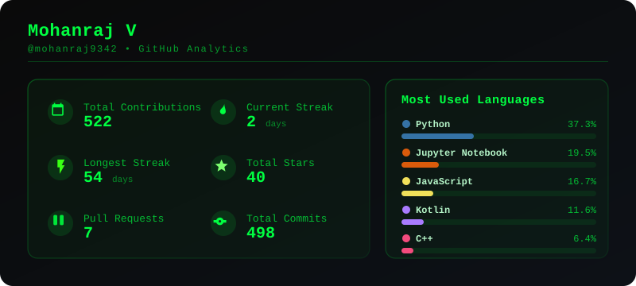

<h1 align="center">Hi 👋, I'm Mohanraj V</h1>
<h3 align="center">B.Tech CSE (AI & ML) Student | AI/ML Developer | Full-Stack AI Developer</h3>

# 💫 About Me:
🔭 I’m currently working on AI/ML and Full-Stack projects  
👯 I’m looking to collaborate on Open Source and AI projects  
🤝 I’m looking for help with MLOps and Cloud Deployment  
🌱 I’m currently learning Cybersecurity  
💬 Ask me about Python, Java, AI/ML and Linux  
⚡ Fun fact: I spend more time customizing Linux than actually using it

## 🌐 Socials:

# 💻 Tech Stack:

### Activity Statistics

  

---

### ✍️ Random Quote

>  I use Arch BTW ❌  I use Malware BTW ✅.
---
